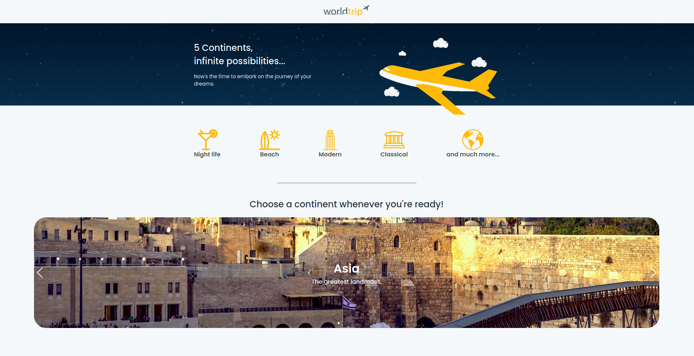

# Rocket Seat Ignite - World Trip Landing Page

<p align="center">
  
</p>

## Table of Contents

- [About](#about)
- [Getting Started](#getting_started)
- [Usage](#usage)
- [Docs](#docs)
- [Resources](#resources)

## About <a name = "about"></a>

A beautiful landing page made with ReactJS, NextJS and Chakara UI.

- [Figma](https://www.figma.com/file/8QAkMs3BddatXn2fFseyu4/Desafio-1-M%C3%B3dulo-4-ReactJS/duplicate)

## Getting Started <a name = "getting_started"></a>

### Prerequisites

- `node >= 12.0.0`

### Installation

1. Clone this repo locally and install the required packages:

```bash
$ git clone https://github.com/librity/ignite_worldtrip.git
$ cd ignite_worldtrip
$ yarn install
```

2. Start a dev server:

```bash
$ yarn dev
```

3. Open http://localhost:3000 on your web browser.

## Usage <a name = "docs"></a>

You can select a continent from the Hero, and browse its most-visited cities.

## Docs <a name = "usage"></a>

- https://nextjs.org/docs/api-reference/create-next-app
- https://unsplash.com/developers
- https://chakra-ui.com/docs/getting-started

## Resources <a name = "resources"></a>

- https://javascript.plainenglish.io/setup-a-next-js-app-with-typescript-and-chakra-ui-f3a6c39dec48
- https://www.visualcapitalist.com/the-100-most-popular-city-destinations/
- https://bigseventravel.com/the-most-visited-cities-world-2019/
- https://github.com/chakra-ui/chakra-ui/issues/200
